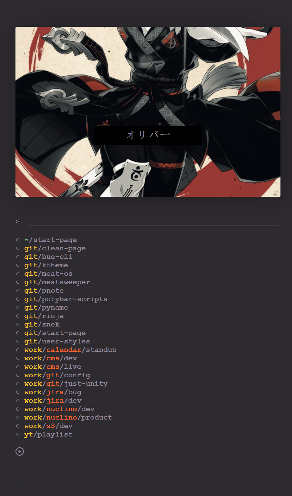

# clean-page

### searchbar commands
- (searchvalue)
- setimg (url to image)
- setname (name)
- setsearch (searchurl, like https://duckduckgo.com/?q=)
- -r (subreddit) <- Reddit
- -e7 (heroname) <- Epic7x
- -mal (anime) <- MyAnimeList

### keyboardnavigation
- f (vimlike navigation, can be closed with f/esc)
- c (config screen)
- s (focuses searchbar)
- escape (closes popups and vimthing)
- delete (delete entry when selected)
- keyup (selects the previous entry)
- keydown (selects the next entry)

